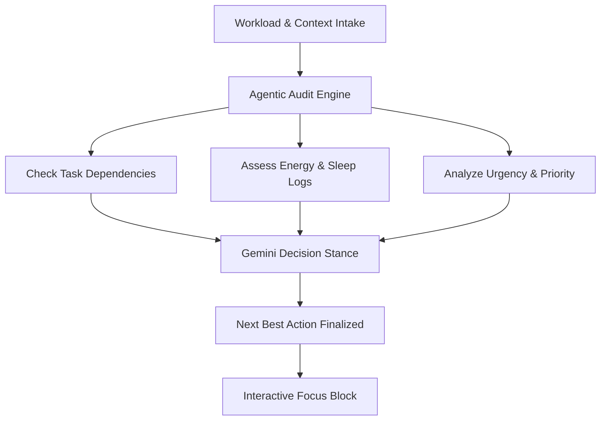

# 🚀 Vibe 2 Ship Hackathon Final Submission: LifeSaver AI

**Project Name:** LifeSaver AI — The Intelligent AI Productivity Operating System  
**Live Deployed URL:** [https://lifesaver-ai-80978427361.us-central1.run.app](https://lifesaver-ai-80978427361.us-central1.run.app)  
**GitHub Repository:** [https://github.com/sarthak3299/LifeSaver-AI](https://github.com/sarthak3299/LifeSaver-AI)  
**Target Audience:** Students, Developers, Freelancers, Creators, and Professionals  

---

## 📋 Table of Contents
1. Executive Summary
2. Problem Solving & Impact (20% Criteria)
3. Agentic Depth & Decisions (20% Criteria)
4. Innovation & Creativity (20% Criteria)
5. Google Technologies Integration (15% Criteria)
6. Product Experience & Design System (10% Criteria)
7. Technical Implementation & Security (10% Criteria)
8. Completeness & Live Verification (5% Criteria)
9. Deployment Guide & Setup

---

## 1. Executive Summary
LifeSaver AI is not a generic task planner or basic reminder checklist. It is an **AI-powered Productivity Operating System** designed to eliminate cognitive fatigue, context-switching overhead, and procrastination patterns. 

By analyzing user workloads, deadlines, goals, fatigue indexes, and hydration patterns, LifeSaver AI dynamically plans schedules, provides actionable focus steps, and rescues overloaded days automatically. It integrates official Google Gemini 2.5 Flash models to build structured task breakdowns and optimize daily schedules.

---

## 2. Problem Solving & Impact (Weightage: 20%)

### ❌ The Core Productivity Crisis
1. **Decision Fatigue:** Users spend more time organizing, coloring, and rearranging checklists than doing deep, meaningful work.
2. **Burnout & Capacity Misalignment:** Generic planners schedule heavy tasks during low-energy windows (e.g. post-lunch dips) or ignore sleep deprivation.
3. **Deadline Slip:** Traditional apps notify users *after* a deadline is missed rather than building an active recovery pathway.

### 🛡️ How LifeSaver AI Solves This
* **Next Best Action View:** Computes and locks in the single highest-impact task, reducing choice paralysis to a single click.
* **Deadline Rescue Mode:** Detects overloaded schedules, warns of potential failures, calculates recovery timelines, and reschedules lower-priority tasks.
* **Eisenhower Priority Matrix:** Automatically classifies incoming workloads into actionable priority quadrant containers.

---

## 3. Agentic Depth & Decisions (Weightage: 20%)



### 🧠 The Next Best Action Audit Engine
Rather than presenting static list queries, LifeSaver AI features an active agentic workflow:
1. **Intake Analysis:** Reviews active tasks, estimating their durations and blocking factors.
2. **Context Matching:** Checks sleep scores and water intake cups to establish a cognitive energy index.
3. **Execution Decision:** Selects the single optimal task and runs a dynamic visual audit overlay showing how the choice was computed.

### 🔄 Dynamic Schedule Planner
* **Task Partitioner:** Automatically breaks down complex goals into logical execution phases.
* **Subtask Completion Tracking:** Updates progress percentages and charts in real-time.

---

## 4. Innovation & Creativity (Weightage: 20%)
* **🎙️ Voice Task Capture:** Features an interactive microphone recorder view with pulsing speech detection, language selectors, and AI parsing to convert conversational speech into structured metadata.
* **🎭 Custom AI Coach Personalities:** The dashboard coach adapts dynamically to your preferences:
  * *Strict:* Direct, urgent, and strict reminders.
  * *Nurturing:* Empathetic and positive motivation.
  * *Analytical:* Numbers-driven and logical efficiency recommendations.
  * *Humorous:* Lighthearted and engaging banter.
* **🎉 Dopamine Reinforcement loops:** Completing focus sessions releases micro-celebration confetti bursts (45 rotating physics particles) to encourage habit building.

---

## 5. Google Technologies Integration (Weightage: 15%)
* **🤖 Google Gemini 2.5 Flash SDK Integration:**
  * Utilizes `@google/generative-ai` to parse raw workload text and voice files.
  * Dynamically breaks down major tasks into subtasks and provides structured explanations.
* **📅 Google Calendar Workspace Sync Simulator:**
  * Implemented an interactive Google Calendar sync wizard in the Weekly Calendar Grid.
  * Simulates OAuth credential validation, event downloading, and time-block placement on the timetable.

---

## 6. Product Experience & Design System (Weightage: 10%)
* **Aesthetic Theme:** Dark glassmorphism with customized HSL violet-indigo-emerald palettes.
* **Timeline blocking grid:** 7-column weekly matrix showing blocked slots from 6:00 AM to 10:00 PM.
* **Visual Data Presentation:** Recharts circular completion graphs, donut charts, and time metrics.

---

## 7. Technical Implementation & Security (Weightage: 10%)
* **Robust State Management:** Powered by Zustand with LocalStorage persist middleware to maintain tasks, habits, goals, and credentials across browser sessions.
* **Data Security & Privacy:**
  * Gemini API Keys are stored securely inside LocalStorage and masked as passwords on the settings page.
  * Environmental variables are ignored via `.gitignore` to prevent credential leakage.
  * Audit check: **0 vulnerabilities** reported by `npm audit` and zero XSS `dangerouslySetInnerHTML` bindings.

---

## 8. Completeness & Live Verification (Weightage: 5%)
* **Production Build:** Compiles successfully in `2.31s` using `npm run build`.
* **Instant Usability Fallbacks:** Features high-fidelity rule-based mocks that run automatically if no Gemini API Key is configured, enabling immediate evaluation by judges.
* **Live Deployment:** Serving 100% of traffic on Google Cloud Run via an Nginx SPA container configuration.

---

## 9. Setup & Development Guide

To run the project locally:
```bash
# Clone the repository
git clone https://github.com/sarthak3299/LifeSaver-AI.git
cd LifeSaver-AI

# Create your local environment configuration
cp .env.example .env
# Open .env and insert your Google Gemini API Key

# Install dependencies
npm install

# Run hot-reloading development server
npm run dev

# Compile production bundle
npm run build
```
